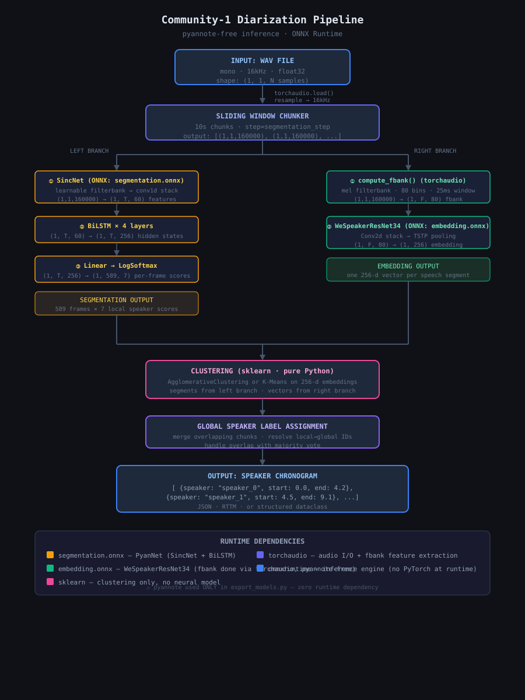

# Speaker Diarization Pipeline

A minimal, production-minded speaker diarization pipeline built on top of the [Community-1](https://github.com/pyannote/pyannote-audio?tab=readme-ov-file) pretrained model. Given an audio file, it outputs a chronogram of speaker turns. Models are exported to ONNX and OpenVINO format at build time. Inference runs on standard CPU with no cloud calls.

Implements: **streaming with WebSocket API (A)** and **multi-file batch processing (C)**.

---

## Pipeline Overview



Audio is processed in overlapping 10-second chunks with a 1-second hop. Each chunk goes through two stages:

**1. Segmentation** — PyanNet (SincNet + BiLSTM) runs on each chunk and outputs per-frame powerset probabilities over 7 classes (silence, speaker A, speaker B, speaker A+B, etc.). Frames below a confidence threshold are silenced. Contiguous active frames per speaker slot are collapsed into intervals and merged across chunk boundaries.

**2. Embedding** — Each merged speech interval is encoded into a 256-d L2-normalised vector by WeSpeakerResNet34. fbank features are extracted in Python (torchaudio) rather than relying on the model's internal ops, which don't export cleanly to ONNX.

**3. Clustering** — All embeddings are clustered globally using agglomerative clustering (Ward linkage on L2-normed vectors, cosine-equivalent). Speaker count is either provided or estimated via an eigenvalue gap heuristic on the affinity matrix. Consecutive same-speaker segments within a configurable gap are merged, and short segments below a minimum duration are dropped.

Two modes are supported:

- **`Diarization`** — processes the full file, clusters globally. Produces the most accurate output.
- **`StreamingDiarization`** — chunk-by-chunk streaming mode. Matches each new embedding against a rolling speaker memory via cosine similarity and EMA updates. No global clustering step; lower latency, less accurate.

---

## How to Run
### Downloade model artifacts

```bash
./download_models.sh
```

### Local — batch CLI

```bash
PYTHONPATH=src python cli.py audio/ --models-dir models --num-speakers 2 --output results/
```

Options: `--backend onnx|openvino`, `--workers N`, `--format json|rttm`

### Local (API server)

```bash
PYTHONPATH=src MODELS_DIR=models CONFIG_PATH=config.yaml python server.py
```

```bash
# Health check
curl http://localhost:8000/health

# Submit a file
curl -X POST http://localhost:8000/diarize \
  -F "file=@audio/debate.wav" \
  -F "num_speakers=2"
```

### Docker
```bash
# Build
docker build -t diarization .

# Run API server (models mounted at runtime — not baked into image)
docker run --rm -p 8000:8000 \
  -v $(pwd)/models:/app/models:ro \
  -v $(pwd)/config.yaml:/app/config.yaml:ro \
  diarization
```

Or with Compose:

```bash
docker compose up
```

The default container entry point is the uvicorn API server. Override with `python cli.py` for batch CLI use.

---

## A — Streaming

### WebSocket endpoint

```
WS /ws/diarize
```

**Protocol (client → server):**

1. First message — JSON config:
   ```json
   {"sample_rate": 16000, "num_speakers": 2}
   ```
2. Subsequent messages — raw PCM binary frames: **int16, mono, 16 kHz, exactly 320 KB per message** (160 000 samples × 2 bytes = 10 s chunk).
3. Text message `"flush"` — triggers final output and resets the pipeline.

**Protocol (server → client):**

One JSON object per committed segment as they arrive:
```json
{"speaker": "speaker_0", "start": 1.200, "end": 3.400}
```
On flush:
```json
{"event": "done", "num_speakers": 2}
```

### Audio encoding

The pipeline works in **16 kHz mono float32** internally. The WebSocket uses **int16 PCM** — the native output of the Web Audio API and most capture libraries — to avoid base64 overhead. The server normalises to float32 by dividing by 32768.

fbank features use Kaldi-compatible settings (80 mel bins, 25 ms window, 10 ms shift), extracted via `torchaudio.compliance.kaldi.fbank`, matching what WeSpeakerResNet34 was trained on.

### Speaker consistency

`StreamingDiarization` maintains a rolling speaker memory — a dict of `{speaker_id → 256-d embedding}`. Each new embedding is matched to the closest known speaker by cosine similarity. If the best match exceeds `stitch_threshold` (default 0.7), that speaker is reused and their prototype updated via EMA (decay 0.3). Below the threshold, a new speaker is created.

**Limitation:** without global clustering there is no cross-chunk label correction. Over long recordings the EMA prototype can drift, and two acoustically similar speakers may merge. For accurate long-form diarization use `Diarization` (full-file mode) instead.

### Streaming latency

Per-chunk wall time on CPU (1000 runs, 5 warmup, random inputs):

| Stage | ONNX | OpenVINO |
|---|---|---|
| Segmentation (10 s chunk) | ~40 ms | ~48 ms |
| Embedding (1 s segment) | ~19 ms | ~24 ms |

End-to-end latency per 10 s chunk is ~60–100 ms depending on how many embedding calls the chunk produces. **To reduce latency given more time:** INT8 quantization of the embedding model; async embedding pipeline (overlap segmentation and embedding of adjacent chunks); shorter chunk duration (requires retracing PyanNet, accuracy will degrade).

---

## C — Multi-file Batch Processing

```bash
PYTHONPATH=src python cli.py audio/ \
  --models-dir models \
  --workers 4 \
  --output results/ \
  --format json   # or rttm
```

- **Input**: single WAV or directory (recursively globbed for `*.wav`)
- **Parallelism**: `--workers N` uses a `ThreadPoolExecutor`, each thread with its own pipeline instance. Sufficient for I/O-bound concurrency; swap to `ProcessPoolExecutor` for true CPU parallelism (one-line change)
- **Failure isolation**: each file is wrapped in try/except; failures are logged per-file and the batch continues. Exit code 1 if any file failed
- **Output**: per-file JSON or RTTM written to `--output`, file stem preserved
- **Throughput**: RTF (wall time / audio duration) logged per file

JSON output:
```json
{
  "file": "debate.wav",
  "duration": 142.3,
  "num_speakers": 2,
  "backend": "onnx",
  "error": null,
  "segments": [
    {"speaker": "speaker_0", "start": 0.0, "end": 4.2, "duration": 4.2},
    {"speaker": "speaker_1", "start": 4.5, "end": 9.1, "duration": 4.6}
  ]
}
```

RTTM output (compatible with `pyannote.metrics` DER computation):
```
SPEAKER debate 1 0.000 4.200 <NA> <NA> speaker_0 <NA> <NA>
SPEAKER debate 1 4.500 4.600 <NA> <NA> speaker_1 <NA> <NA>
```

---

## Benchmark — ONNX Runtime vs OpenVINO (CPU)

Measured on CPU with `time.perf_counter()` over 1000 runs (5 warmup), using random inputs.
Input sizes: segmentation `1×1×160000` (10s chunk), embedding `1×98×80` (1s chunk).

| Model | ONNX mean | ONNX std | OpenVINO mean | OpenVINO std | Winner |
|---|---|---|---|---|---|
| Segmentation (PyanNet) | 40.59ms | ±8.56ms | 48.40ms | ±5.80ms | ONNX ✓ |
| Embedding (WeSpeakerResNet34) | 19.39ms | ±1.75ms | 23.90ms | ±2.17ms | ONNX ✓ |

**ONNX Runtime wins on both models** on this hardware (~0.84x speedup on segmentation, ~0.81x on embedding).

Notably, OpenVINO shows **lower variance** on the segmentation model (±5.80ms vs ±8.56ms), which may matter in latency-sensitive deployments where worst-case tail latency is the constraint rather than average throughput.

> Results are hardware-dependent. OpenVINO is expected to close the gap or outperform on Intel hardware with AVX-512 or on devices with an integrated NPU. 

---

## Design Decisions and Trade-offs

| Decision | Rationale |
|---|---|
| ONNX + OpenVINO, switchable via `--backend` | ONNX for portability and out-of-the-box CPU/CUDA support; OpenVINO for potential gains on Intel hardware with AVX-512 or NPU. On benchmarked hardware ONNX wins (~19ms vs ~24ms on embedding). |
| fbank extracted in Python (torchaudio) | WeSpeakerResNet34's internal fbank ops don't trace cleanly through ONNX export. torchaudio is equivalent and keeps the exported model minimal. |
| Models mounted at runtime, not baked into image | Keeps the Docker image lean and avoids HuggingFace token requirements at build time. Export is a separate offline step. |
| Agglomerative clustering (Ward linkage) | No need to pre-specify `k`; handles variable speaker count naturally. Ward linkage on L2-normed vectors is equivalent to cosine clustering without a custom metric. |
| Eigenvalue gap heuristic for speaker count | Simple, deterministic, no learned model needed. Falls back to 2 on failure (covers the most common case). |
| `StreamingDiarization` uses EMA speaker memory | Avoids storing all embeddings for global clustering in streaming scenarios. Trade-off: speaker consistency degrades over long files as the memory drifts. |
| `ThreadPoolExecutor` for batch | Simpler than Process; sufficient for I/O-bound concurrency. Swap to `ProcessPoolExecutor` for true multi-core throughput (one-line change). |

---

## What I Would Improve Given More Time

- **Speaker count estimation**: replace the eigenvalue heuristic with a calibrated BIC or a small classifier trained on the affinity gap features.
- **INT8 quantization**: quantise the embedding model for ~2× CPU throughput improvement on both batch and streaming paths.
- **ProcessPoolExecutor for batch**: one-line swap from Thread to Process pool to bypass the GIL for true multi-core batch throughput.
- **Resource-aware scheduling (D)**: profile file duration and system CPU/memory load before dispatch; dynamically reduce worker count under memory pressure; emit a utilization summary at batch end.
- **Proper DER evaluation**: compute Diarization Error Rate against ground-truth RTTM files so threshold tuning has a measurable signal.
- **Chunk boundary artefacts**: the sliding window can split a speaker turn at a chunk edge; overlap-and-vote on the overlapping region would reduce boundary errors.
- **Live UI demo**: browser client connecting to `/ws/diarize` via the Web Audio API for real-time visualization.


## References Papers and Related Topics
- [1] Mirco Ravanelli, Yoshua Bengio, “Speaker Recognition from raw waveform with SincNet” [Arxiv](https://arxiv.org/abs/2109.08910)
- [2] MS-SincResNet: Joint Learning of 1D and 2D Kernels Using Multi-scale SincNet and ResNet for Music Genre Classification [Arxiv](https://arxiv.org/abs/2109.08910)
- [3] Curricular SincNet: Towards Robust Deep Speaker Recognition by Emphasizing Hard Samples in Latent Space
[Arxiv](https://arxiv.org/abs/2108.10714)
- [4] Interpretable SincNet-based Deep Learning for Emotion Recognition from EEG brain activity [Arxiv](https://arxiv.org/pdf/2107.10790)
- [5] Toward end-to-end interpretable convolutional neural networks for waveform signals [Arxiv](https://arxiv.org/pdf/2405.01815)
- [6] Filterband design for end-to-end speech separation [Arxiv](https://arxiv.org/pdf/1910.10400). This paper decomposes sinNet into a product sin * cos as implemented in this repo and bridgin the gap with Gabor filterbank


## Projects Worth Checking
- https://github.com/mravanelli/SincNet
- https://github.com/mravanelli/pytorch-kaldi
- https://github.com/PeiChunChang/MS-SincResNet
- https://github.com/ZaUt-bio/Exploring-Filters-in-SincNet-Access-and-Visualization/blob/main/SincNet_filters_visualization_initials.ipynb
- https://github.com/wkzng/iSincNet